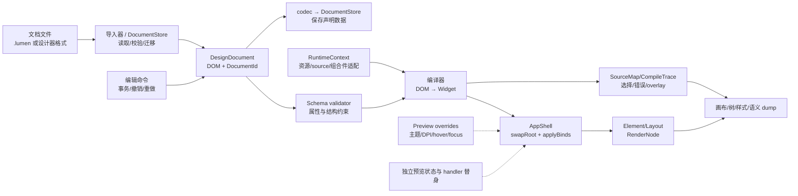

# Lumen 设计器前置条件与缺口分析

> 文档状态：规划提案（2026-09-30）
> 定位：登记「可视化设计器」的能力基线、结构性缺口、前置工程与待决策项，作为设计器立项前的评审入口。
> 边界：本文不改变任何既有排除项口径（含「DSL 可编程化」，见 §4.3），不构成开工授权；§8 待决策项由用户显式决策后才进入实施。
> 证据基线：2026-09-30 源码核对（HEAD `e2c61ef`）。[`support-matrix.md`](support-matrix.md) 记录的 `3fede85` / 935 项与 [`M15+ 路线图`](lumen-m15-roadmap.md) R6 首批的 940 项是不同历史批次。本文的本轮校验见 §10.3，规划 API 不计入已实现能力。

## 1. 背景与形态定义

### 1.1 盘点结论（2026-09-30）

对照「可视化设计器」所需能力逐项核对源码后结论如下：

- 框架层（控件库、离屏渲染、命中测试、主题/状态预览、命令分发、多窗口/IME/DPI）已经具备承载**只读预览工作台**的主要地基；运行时 Inspector 仍缺少选中节点后的 bounds/damage overlay；
- **可编辑并保存的双向设计器**被三类结构性问题阻塞：声明式文档模型与双向转换缺失（G-D1）、属性/节点 schema 缺失（G-D2）、声明式文档与运行时 Widget/controller 的边界和格式治理未冻结（G-D3、G-D8）；
- 稳定编辑身份、源位置映射、版本迁移、绑定/资源注入和文档级事务也没有现成契约。这些不是单纯的 UI 面板工作，而是 D3 的前置条件。

本文将上述缺口登记为可评审、可验收的前置工程，不预设任何决策结论。

### 1.2 设计器三形态

后文所有缺口与阶段均以下表三形态表述。「设计器」一词单独出现时指三者总称。

| 形态 | 定义 | 对 UI 文档的权限 | 前置条件 |
| --- | --- | --- | --- |
| D1 检查器 | 运行中应用的只读诊断：树可视化、bounds/damage overlay、帧统计 | 无（观测运行时树） | tree/style dump 与帧统计已有；Inspector、节点选择和 bounds/damage overlay 仍属 R6 |
| D2 预览工作台 | 打开 `.lumen`/应用提供的示例，画布渲染 + 结构浏览 + 环境/状态预览 | 只读 | 基础运行时预览可独立交付；文档定位版需要 P1 读取/编译子集、P3 预览适配与 P4 映射 |
| D3 可编辑设计器 | 文档编辑：工具箱拖入、属性就地编辑、结构重排、保存/导出 | 读写 | DP-1 决策 + P1–P5 + 编辑命令栈 |

与既有规划的关系：D1 的范围与 R6（开发者诊断）的未交付项重合，属
[`lumen-gui-completion-plan.md`](lumen-gui-completion-plan.md) 阶段 D 的收口，不需要新编号；
D2/D3 若立项，建议在完成计划缺口矩阵新增条目并同步支持矩阵（编号留待决策，见 §8）。

### 1.3 阅读约定与分析方法

本文把“已经能调用”与“已经可以交付”分开记录。能力状态沿用完成计划的四态：

| 状态 | 这里能证明什么 | 不能据此推出什么 |
| --- | --- | --- |
| 接口已存在 | 公共契约、Fake/Recording 路径和线程归属已经明确 | 真实窗口、系统服务或发布包可用 |
| headless 已验证 | 无窗口行为、错误路径和确定性输出有自动化证据 | 三桌面输入、字体、合成器和辅助技术已经通过 |
| 真实平台已验证 | 指定桌面上的窗口、输入、资源或系统服务有现场证据 | 其他桌面或干净机器发布链条通过 |
| 可发布 | 干净机器可安装、启动、使用并能追溯版本 | 设计器已覆盖所有控件或支持任意 C++ builder |

“G-Dx”表示缺口，“Px”表示前置工程，“DP-x”表示必须由产品/架构负责人明确的
决策。缺口只登记设计器需要的契约；已有框架能力不因为设计器出现而重复立项。本文的
盘点顺序是：先核对源码和公共头文件，再核对测试、完成计划和支持矩阵，最后把结论写成
可验收的接口、失败路径和出口条件。源码证据只能证明当前提交的事实，不能替代三桌面
真实平台验收。

本文的范围继续受仓库顶层 `AGENTS.md` 约束：目标是 Windows/Linux/macOS 桌面，移动端
保持冻结；设计器文档格式属于数据序列化，不能引入脚本、变量、条件、循环或其他 DSL
可编程能力。任何改变冻结节点集或移动端范围的提议都必须另行获得明确决策并同步相关
设计文档。

### 1.4 设计器的最小用户任务与成功定义

三种形态应以用户任务而不是面板数量验收。下表中的“成功”同时要求正常路径和错误路径
可观察、可恢复，并且不把运行时状态误写回文档。

| 任务 | 适用形态 | 成功定义 |
| --- | --- | --- |
| 定位运行时问题 | D1 | 从树或画布选中节点，看到 bounds/damage/frame 读数，并能回到对应的运行时节点 |
| 比较声明与视觉结果 | D2 | 打开文档，在主题、密度、DPI、字体缩放和交互状态之间切换；错误时仍保留上一份有效画面 |
| 修改一个属性 | D3 | 属性校验失败不产生半提交状态；成功修改可撤销、重做、保存并重开一致 |
| 修改结构 | D3 | 插入、删除、复制、重排后选择、诊断和源位置仍指向正确的 `DocumentId` |
| 使用应用数据预览 | D2/D3 | 业务数据源可以被替身或快照取代；缺失引用显示诊断，不启动网络、数据库或任意业务代码 |
| 交付文档 | D3 | 文档格式、版本、资源引用和迁移结果可追溯；保存中断不会破坏最后一份有效文件 |

### 1.5 总体数据流与所有权边界

设计器的核心边界是“DOM 是编辑源，Widget 是编译产物，RenderNode 是观测结果”。下图
把现有能力和待建能力放在同一条链上；虚线表示会话预览输入，所有新名称均为候选设计。



所有权规则如下：`DocumentStore` 只拥有文件读写；`DesignDocument` 只拥有声明数据；
`RuntimeContext` 提供资源和 controller 的解析结果；预览会话必须为整个运行树寿命保活这些
对象（§4.11），`AppShell` 拥有状态、handler 注册表和 Widget/Element 生命周期；设计器 overlay
绘制辅助信息，输入路由由会话显式管理（§5）。任何跨边界的裸指针、
业务回调、布局结果或动态物化行都不能成为文档持久化字段。

## 2. 已具备的能力基线（不重新立项）

以下能力已实现并有测试/文档证据，设计器直接消费；只在发现回归时补验。

| 能力 | 设计器用途 | 证据 |
| --- | --- | --- |
| 离屏像素画布 | 设计器画布直接取 RGBA 帧；确定性 hash 支撑快照对照 | `include/lumen/render/cpu_renderer.h`（`pixels()`，纯内存 `PixelBuffer`）；`AppShell::renderFrame`/`paintFrame`（[`include/lumen/app/app_shell.h`](../include/lumen/app/app_shell.h)） |
| 命中链选择 | 画布点选 = 最深命中节点 + 祖先链 | `core::hitTestChain`（`include/lumen/core/interaction.h`） |
| 树遍历与定位 | 大纲面板、滚动到节点、overlay 锚定 | `findNodeByIdentity`/`findNodeByKey`/`absoluteOffset`（`include/lumen/core/render_node.h`）；`AppShell::root()` |
| 结构文本导出 | 大纲/对照工具链地基 | `app::dumpRenderTree`/`dumpStyleTree`/`dumpSemanticsTree`（`include/lumen/app/tree_dump.h`）；`AppShell::buildSemanticsSnapshot()`；settings/Gallery 三个 dump 入口 |
| 交互状态预览 | 按 key 预览 hover/press/focus 视觉；无 key/重复 key 的逐节点覆盖仍需适配 | `AppShell::setVisualPreviewState(key, state)`；`src/style/resolver.cpp` 的 `stateOf` |
| 环境模拟 | 主题方向/明暗、密度、字体缩放、高对比、减少动画、DPI 的实时切换预览 | `style::Theme`（`dark()`/`light()`/`fromSettings()`、`ControlDensity`）；Gallery CLI 开关（`--dpi/--density/--light/--high-contrast/--font-scale` 等） |
| 面板控件地基 | 属性面板（TextField/Spin/ComboBox/ColorPicker/Slider/Form）、大纲（Tree/TreeList）、工具箱/属性表（DataGrid/ToolBar/StatusBar）、布局（Splitter） | `include/lumen/widgets/*.h`；这些是设计器可复用的面板部件，不等于已经存在 Widget 属性反射 |
| overlay 机制 | 高亮、ghost 和辅助线的基础；两类 overlay 共用一个槽位，命中也会切树 | `setOverlayBuilder` / `setVisualOverlayBuilder`（`app_shell.h`）；限制与绕行见 §5 |
| 命令与快捷键分发 | 设计器快捷键单一数据源 | `include/lumen/app/command_registry.h` |
| 撤销栈先例 | 文档级 undo/redo 的事务模型参考 | `include/lumen/text/editing_history.h`（TextField 编辑事务） |
| 持久化 | 设计器设置与临时文件替换的参考；文档耐久保存另建契约 | `include/lumen/core/preferences.h`；`src/core/preferences.cpp`（没有文件/目录同步或迁移链） |
| 热重载联动 | 编辑文本 → 画布即时刷新、错误保持旧 UI | `dsl::DslCache` + counter `--watch` + `AppShell::swapRoot` |
| 多窗口与输入 | 独立预览窗口、IME 编辑属性值、DPI 正确 | `runApp` 多窗口（每窗口独立 shell/renderer/IME） |
| 应用内拖拽 | 工具箱拖入画布、结构重排 | M15 拖放会话状态机（`lumen-drag-drop-design.md`） |
| 帧统计 HUD | D1 性能读数 | `include/lumen/app/frame_debug.h` + `RunOptions.frameDebugOverlay`；默认关闭、无额外帧 |

### 2.1 已有能力的状态边界

“设计器直接消费”不等于“设计器功能已经交付”。当前证据按设计器最关心的消费方式重新
归类如下；日期和测试数字以 [`support-matrix.md`](support-matrix.md) 的记录为准，本文不
复制一份会随每次提交漂移的完整计数。

| 消费能力 | 当前状态 | D1/D2/D3 可直接依赖的部分 | 仍需补的证据或契约 |
| --- | --- | --- | --- |
| Render/style/semantics dump | 接口已存在 + headless 已验证 | 只读树、样式和语义对照、CI 诊断 | D1 的节点选择、bounds/damage overlay、三桌面 inspector smoke |
| CPU 离屏画布与 frame hash | headless 已验证 | 像素输出、固定环境的 golden 对照 | 失败保留旧帧的会话管理、文档映射、zoom/DPI 交互和像素 alpha 模式适配 |
| 命中测试与 overlay | 接口已存在 | 最深命中链、非模态辅助层、拖拽 ghost | 多选/框选、动态节点选择策略、overlay 的坐标变换契约 |
| Theme/状态/DPI 预览 | 接口已存在 + headless 已验证 | 只读环境切换、视觉状态覆盖 | 预览值与声明值分栏显示、切换不污染 dirty/undo 的验收 |
| 拖放与命令分发 | 接口已存在 + headless 已验证 | 应用内工具箱拖入和结构重排的输入基础 | 设计器文档命令的原子事务、失败回滚和多选语义 |
| StateStore/HandlerRegistry | 接口已存在 + headless 已验证 | 应用运行时绑定和事件名称解析 | 设计器的 preview context、引用类型校验、缺失引用占位策略 |
| Preferences/原子写先例 | headless 已验证 | DocumentStore 的实现参考 | 文档 schema 版本、迁移、未知字段和恢复副本 |
| 真实平台窗口/IME/辅助技术 | 部分真实平台证据 | 设计器 UI 可沿用 AppShell/IME/语义接口 | 三桌面窗口 smoke、屏幕阅读器和高 DPI 现场验收 |

因此，D1 可以随 R6 收口；D2 的文档定位版需 P1/P4 才能把选择指回文档；D3 必须等 P1–P5
和文档命令事务完成。这个划分避免把已有的 `dump` 或 HUD 误写成设计器已经可用。

## 3. 缺口总览

| ID | 缺口 | 阻塞形态 | 定性 | 处理 |
| --- | --- | --- | --- | --- |
| G-D1 | 文档表示与序列化双向缺失 | D3 | 结构性（阻塞） | 前置工程 P1（§4.1） |
| G-D2 | 属性元数据/反射缺失 | D3（D2 可降级） | 结构性（阻塞） | 前置工程 P2（§4.2） |
| G-D3 | 文档格式选型触及「冻结节点集 + DSL 可编程化排除」口径 | D3 决策前置 | 治理（决策） | 决策点 DP-1（§4.3） |
| G-D8 | 声明式文档与运行时 Widget/controller/resource 边界未定义 | D2/D3 | 结构性（阻塞） | 前置工程 P3（§4.4） |
| G-D9 | 设计节点没有独立的稳定身份和源码映射 | D2/D3 | 结构性（阻塞） | 前置工程 P4（§4.5） |
| G-D10 | 文档版本、迁移、未知字段和损坏恢复契约缺失 | D3 | 结构性（阻塞） | 前置工程 P5（§4.6） |
| G-D11 | 绑定、命令、主题、资源引用没有设计器侧解析/注入协议 | D2/D3 | 结构性（阻塞） | P3 + 应用适配层（§4.4） |
| G-D12 | 预览状态和文档声明状态没有隔离协议 | D2/D3 | 行为风险 | §4.7；禁止把运行时状态写回文档 |
| G-D13 | 文档编辑命令的事务、合并、撤销和保存状态未定义 | D3 | 设计器结构性（阻塞） | §4.14；设计器应用工程，不新增框架核心工作项 |
| G-D14 | 多选、坐标变换和动态节点选择语义未定义 | D2/D3 | 交互契约（阻塞） | §4.15；基于现有 hit test/overlay 扩展 |
| G-D15 | 解析、schema、引用、编译和保存错误没有统一诊断协议 | D2/D3 文档流程 | 质量契约（阻塞） | §4.16；适配 `DslError`，不阻塞 D1 的运行时诊断 |
| G-D16 | 外部资源、文档信任边界和异步生命周期未定义 | D2/D3 | 生命周期/安全风险 | §4.17；RuntimeContext 与 DocumentStore 共同约束 |
| G-D4 | 无通用绝对定位容器（仅 Stack 子级 `stackPosition`） | D3 自由画布 | 可绕过 | §5 |
| G-D5 | 无自绘光标（仅 11 种系统形状） | D3 编辑体验 | 可降级 | §5 |
| G-D6 | OS 拖出结构化不可用（SDL 3.2.10） | 边缘场景 | 已登记，维持 | §5 |
| G-D7 | 无 Canvas 类自绘面板控件，overlay 共槽位 | D1/D2/D3 辅助层 | 可绕过或立项 | §5 |

另有一类**设计器自建能力**（非框架缺口，框架已有地基）：文档级编辑命令栈
（undo/redo，基于 CommandRegistry + 编辑事务先例）、编辑选择模型（单选/多选/框选，
框架 `SelectionModel` 是集合控件语义，不直接复用）、吸附/对齐规则引擎，以及设计器
自己的诊断面板和资源适配层。它们属于设计器应用实现，登记于 §6 阶段范围，不开框架工作项；
但 G-D13–G-D16 仍是 D3 的进入条件，必须建立在 P1–P5 定义的文档事务、节点身份和引用
解析契约之上。

## 4. 核心缺口

### 4.1 G-D1：文档表示与序列化

#### 现状与证据

1. **解析是单向的，导出完全缺失。** `.lumen` 只能 `parseLumen/parseLumenFile →
   DslParseResult{Widget root, optional<DslError>}`（`include/lumen/dsl/text_dsl.h`）；
   `src/dsl/` 与 `include/lumen/dsl/` 中不存在任何 Widget→文本的序列化函数。私有
   `AstNode` 的属性顺序、注释、空白和源位置在转换成 `Widget` 后也无法恢复。
2. **文本 DSL 节点集冻结在 12 个基础节点。** `src/dsl/text_dsl.cpp` 的 `widgetTypeOf`
   只认：`Container`、`Row`、`Column`、`Stack`、`Text`、`Button`、`TextField`、
   `ScrollView`、`ListView`、`Checkbox`、`Switch`、`FocusScope`。这是当前 parser 的
   allowlist，不是整个框架的控件总数。`WidgetType` 枚举目前有 27 个条目；其余包括
   `Grid`、`Image`、`VirtualList`、`Icon`、`Slider`、`ProgressBar`、`Radio`、
   `Tooltip`、`Dropdown`、`Tabs`、`ThemeScope`、`List`、`Tree`、`TreeList`、
   `Splitter`，都没有对应的文本节点转换路径。
3. **Widget 不是纯声明式文档。** 除了布局、文本、样式、绑定和 handler 名称，Widget
   还携带运行时状态、资源句柄和应用拥有的引用：
   - 指针引用：`themeOverride`、`virtualSource`、`collectionColumns`、`splitterSource`
     （主题、列表/树/网格、分隔器 controller 的裸指针，不能把指针值写入文件）；
   - 运行时资源 id：`imageId`（重启或资源代际变化后失效，应保存 `imageSource` 或稳定资源名）；
   - 动态子树：List/Tree/TreeList/VirtualList 的行由 source 在布局期物化，不是文档 children；
   - 当前状态：`scrollOffset`、`selected`、`checked`、`transitionAlpha`、焦点/交互状态等，
     必须区分声明初值和预览/运行时快照；
   - `bind`/`onClick` 是字符串引用，**可以**序列化，但加载侧必须经 StateStore/
     HandlerRegistry 或设计器应用适配层解析，不能假设任意 C++ lambda 可逆向生成。
   `semanticsActions`、语义覆盖和 `StyleOverrides` 可序列化，但必须在 schema 中标记为
   声明属性或运行时派生属性，不能靠“遍历 Widget 全字段”自动决定。
4. **控件类型和组合控件不是一一对应。** ComboBox、ColorPicker、Spin、ToolBar、
   StatusBar、Menu、DialogHost、Navigator、Form 和 DataGrid 主要由 widgets 层 controller
   组合出 Widget 子树；即使设计器能观察到运行时树，也不能从展开后的 Button/Text/Row
   子树唯一还原原始 controller 配置。设计器必须保存组合件节点或明确的应用适配引用。

#### 影响

D3 的「保存/导出」无路可走；即便增加一个 `Widget -> .lumen` printer，也只能对可表达的
静态子集生成规范化文本，无法恢复注释/格式、controller 构造意图和运行时引用。先定义
设计器文档模型，再决定是否把它投影到 `.lumen`，是 DP-1 的实质。

#### 前置工程 P1：文档对象模型与双向转换

设计器内部维护**可编辑文档对象模型（DOM）**，与 `Widget` 树是两个实体：
DOM --编译--> Widget 树（渲染/预览用）；DOM --序列化--> 文档文件；文档文件 --解析--> DOM。
运行时 Widget 树永不直接回写 DOM；用户确认的编辑命令才修改 DOM。这样可以区分声明属性、
预览状态和 controller/source 注入，也避免把布局结果、焦点和虚拟列表行写回文档。

DOM 的最小节点契约应包含：稳定 `id`、节点类型、typed properties、子节点/插槽、绑定和
命名引用、schema 版本，以及可选的源 span/扩展字段。`Widget` 编译器接收独立的
`RuntimeContext`（StateStore、HandlerRegistry、资源表、主题表、VirtualList/Splitter
source 注册表），未解析引用必须产生结构化诊断而不是写入空指针。

| 方案 | 内容 | 优点 | 代价 |
| --- | --- | --- | --- |
| A：扩展 `.lumen` | 解冻/扩充节点集覆盖全部控件；为 DSL 编写双向序列化器（printer） | 单一格式，与手写热重载工作流直接互通 | 触动冻结口径（多份设计文档「已知限制」锚定该策略，需成套更新 parser/诊断/golden）；控制器类控件（DataGrid 列定义等）需节点化设计，DSL 复杂度上升 |
| B：设计器文档格式 | 另定结构化格式（建议 JSON + schema 版本号），运行时编译为 Widget 树；可选提供 `.lumen` → 文档格式的**单向导入** | 不动冻结口径；schema 可版本化演进；序列化与手写 parser 解耦、测试性好；可表达 C++ builder 全集 | 双格式并存（手写 `.lumen` vs 工具文档），需在文档中明确边界；需要 JSON 解析（见依赖注） |

**推荐 B 起步**：不触碰 G-D3 口径、与 P2 共用一套字段注册表（见 §4.2）、
`.lumen` 单向导入保留与手写工作流的互通；A 作为后续可选升级（若用户希望工具与手写
共用一种格式再评估）。

关键设计点（两方案通用）：

- **指针字段的引用机制**：文档格式以命名引用表达（如 `source: "@list:orders"`、
  `theme: "@theme:dark"`），加载时由 RuntimeContext 的引用表解析到应用注册的实例。
  未解析引用是带 file/line/node id/name 的诊断，不得静默变成空 source 或崩溃。
- **三层往返不变量**：同一 codec 的 `read(serialize(dom)) == dom` 逐字段成立；`.lumen`
  单向导入另测 `parseLumenSource → DOM`，不能把两个格式的 parser 混成一个隐式入口；DOM
  编译出的 Widget 树与手写 C++ builder 的等价声明树做 golden 对照。若要求保留注释、
  属性顺序和原始空白，则必须保留 CST/trivia，不能只从 Widget 反向打印。
- **声明状态与运行时状态分离**：`checked` 的初始值可以存，实际 StateStore 值不存；
  `scrollOffset`、hover/press/focus、虚拟列表窗口、`transitionAlpha` 默认不存；
  `imageId` 存 `imageSource`/稳定资源名，加载时重新注册资源。
- **未知字段和未知节点策略**：设计器文档必须选择“保留并原样写回”或“拒绝保存”之一；
  不能在打开后静默丢失未来版本字段。当前 codec 对显式 `unknownFields` 容器与同级
  扩展字段的同名冲突直接拒绝，避免两个输入字段合并时静默覆盖。
- **源代码边界**：设计器只能逆向 DOM/Widget 声明树，不能从任意 C++ builder、lambda、
  controller 闭包或已展开的 RenderNode 可靠生成原始应用代码。
- **依赖注（仅 B）**：引入 JSON 解析需走 FetchContent 并 pin 修订（AGENTS.md 规则），
  在变更说明中显式登记；若不愿引入依赖，可先自写极简 JSON reader（设计器文档是
  工具产出、非手写，语法面可收窄）或复用 `.lumen` 语法骨架扩展属性表。

**验收**（四态，对齐完成计划 §1）：

- 接口已存在：DOM/序列化/解析/编译四 API + RuntimeContext 引用表 + schema 版本号 +
  声明/运行时属性分类；
- headless 已验证：DOM 往返 golden、Widget 编译 golden、未知引用/未知字段/损坏文件错误
  注入、动态 source 缺失、`.lumen` 单向导入对照；
- 真实平台已验证：属 D3 出口（设计器内打开→编辑→保存→重开一致性）；
- 可发布：不适用（框架层交付物）。

### 4.2 G-D2：属性元数据注册表

#### 现状与证据

全库无反射/属性表机制；`Widget` 是编译期 struct（字段即属性，`include/lumen/core/widget.h`），
全字段 `operator==` 可作变更检测。属性面板、校验、序列化、工具箱提示目前都需要
各自手写字段映射——三处映射必然漂移。

#### 前置工程 P2：PropertyMetadata 注册表

表格驱动（非宏反射），每控件类型登记一份属性描述：

```text
PropertySpec {
    名称（文档格式与面板共用）
    类型：bool / number / string / color / enum / EdgeInsets / TextStyle / …
    取值约束：枚举值列表或数值范围（如 flex >= 0、elevation 0..N）
    默认值（与 Widget 默认成员初始化一致）
    适用控件集（ButtonVariant 仅 Button/Dropdown 等）
    分组：几何 / 布局 / 外观 / 状态 / 语义 / 高级
    读写访问器：对 Widget& 的 get/set（或字段偏移表）
}
```

- **与 P1 协同**：方案 B 的 schema 字段集 = 注册表子集，三处消费（属性面板 UI、
  序列化字段选择、toolbox 提示/校验）共用一套真相。
- **防漂移（关键风险）**：守护测试遍历注册表，逐属性「写→读回→断言」，
  并对 `Widget` 做字段计数对照——新增 Widget 字段未登记元数据时测试失败，
  强制同步。
- 覆盖范围以 `widget.h` 当前 27 种 `WidgetType` 和 widgets 层组合件为准；先覆盖 D3
  首版选定的控件集（见 DP-3），但注册表接口必须能扩展到其余类型和组合件。
- 元数据不能只描述字段，还要描述节点可否作为根、允许的父节点、子节点数量/插槽、默认
  工厂、可见性条件、是否声明属性、是否由运行时派生，以及拖入工具箱的创建规则。
- `imageId`、controller 指针、生成行、布局 bounds 和交互快照不应被误登记为普通可编辑
  属性；它们要么映射为资源/命名引用，要么在属性面板中只读显示。

**验收**：headless——注册表覆盖测试（逐属性读写往返 + 字段计数守护）；
面板冒烟（每类型属性面板构建/修改/撤销一个属性）。

### 4.3 G-D3：治理口径——冻结节点集与「可编程化」排除项

#### 现状与证据

- 「DSL 可编程化/脚本能力」在 [`lumen-gui-completion-plan.md`](lumen-gui-completion-plan.md) §6
  与 [`lumen-m15-roadmap.md`](lumen-m15-roadmap.md) §1.2 均列为排除项；
- `.lumen` 冻结节点集策略锚定在 [`lumen-gui-framework-plan.md`](lumen-gui-framework-plan.md) §6.2
  （受限文本 DSL、面向手写）与多份控件设计文档的「已知限制」；
- AGENTS.md：偏离设计文档需在同一变更内更新文档。

#### 定性澄清

「工具可读写的数据格式」≠「DSL 可编程化」。可编程化指脚本、变量、条件、循环
（`text_dsl.h` 注释明示 `.lumen` 不含这些）；P1 方案 B 是**数据序列化**，
不引入任何可编程性。但该边界目前只存在于排除项的反面表述中，没有被正面写过——
选 B 时必须在 framework-plan §6.2 或本文后续修订中显式登记这一定性，避免被误读为
变相重开排除项。方案 A 则直接修改冻结策略，成套文档更新是交付物的一部分。

#### 决策

DP-1（§8）由用户显式选择；本文的推荐（B）不构成决定。

### 4.4 G-D8/G-D11：声明式文档、运行时桥接与引用注入

#### 现状与证据

`AppShell` 可以接收一个已构建的 `Widget` 并通过 `swapRoot` 重建运行时树；`StateStore`、
`HandlerRegistry` 和 `applyBinds` 已有应用运行时接线。但这些接口没有一个统一的“设计器
文档引用表”契约。`Widget` 中的 `virtualSource`、`collectionColumns`、`splitterSource`
和 `themeOverride` 是应用所有权对象的裸指针，设计器不能直接持久化或跨文档复制。

组合控件进一步放大这个边界：DataGrid 的列/数据源、Tree/List 的行 source、ComboBox 的
选项/绑定、Dialog/Navigator 的路由和 Menu/ToolBar 的命令都可能在 Widget 树中只留下展开
后的视觉子树。运行时树可用于预览和检查，但不是可逆的文档模型。

#### 前置工程 P3：RuntimeContext 与可诊断的引用协议

定义设计器编译 DOM 时的运行时适配接口，至少包含：

- `StateStore`/绑定值读取策略（预览固定值、应用真实值、未绑定占位）；
- handler/command 名称到 `HandlerRegistry`/`CommandRegistry` 的解析；
- theme、image、font/resource 的稳定名称到运行时资源的解析；
- VirtualList/List/Tree/TreeList/DataGrid/Splitter source 和组合件 controller 的注入；
- 引用缺失、类型不匹配、生命周期已结束时的结构化错误和可视化降级。

设计器预览必须能使用假的 RuntimeContext，不应为了打开文档启动业务网络、数据库或
真实数据源。应用运行时可提供真实适配器，但文档格式只保存稳定引用和声明初值。

**验收**：headless 覆盖成功解析、缺失引用、错误类型引用、预览替身、真实应用注入；
打开文档时不能解引用未验证的裸指针；同一 DOM 在空 context 下仍能生成可检查的占位树。

### 4.5 G-D9：稳定节点身份、源码映射与编辑选择

#### 现状与证据

当前 Element 复用主要依据 `type + key`；无 key 节点使用位置身份，RenderNode 的 identity
由布局路径生成。已有 `findNodeByIdentity`/`findNodeByKey` 可支持运行时定位，但这不等于
设计文档拥有独立的、跨重排稳定的节点 ID。工具箱插入、兄弟节点重排和复制粘贴会改变
位置身份，直接用运行时 identity 保存选择会导致属性面板跳到错误节点。

当前文本解析错误有 file/line/column，但成功解析结果没有向 Widget 暴露节点 source span；
因此不能可靠地从画布选中节点跳回文本位置，也不能在保存时对原文件做局部 patch。

#### 前置工程 P4：DocumentId 与 SourceMap

- 每个 DOM 节点分配持久 `DocumentId`，复制时生成新 ID，重排时保持原 ID；`key` 继续作为
  应用语义/状态复用键，不能替代编辑器 ID。
- 编译时维护 `DocumentId -> Widget/Element/RenderNode identity` 映射；重建失败时保留
  上一份可运行树并把错误绑定到 DOM 节点。
- `.lumen` 导入至少记录 node/attribute 的 source span；若选择保留注释和格式，则升级
  为 CST/trivia。私有设计器格式可只保存结构化 source map。
- 画布选择、大纲选择、属性面板和错误列表都以 `DocumentId` 为主键，key/identity 只作
  运行时查询辅助。

**验收**：插入、删除、复制、重排、撤销/重做后选择仍指向同一 DocumentId；文本错误能定位
到节点和属性；Widget 重建后映射不会把一个节点的 bounds 显示到兄弟节点上。

### 4.6 G-D10：格式版本、迁移、未知字段与损坏恢复

#### 现状与证据

`Preferences` 有版本和原子写的先例，但 `.lumen` 没有 schema 版本、迁移入口、未知属性
保留策略或设计器文档的临时恢复文件。直接使用 `Widget` 默认值反序列化会把“字段缺失”、
“旧版本字段”和“用户有意设置为默认值”混在一起。

#### 前置工程 P5：可演进的文档存储协议

文档必须带格式版本和应用/工具元数据；加载流程固定为“读取 → 校验 → 迁移 → schema
验证 → 编译”，迁移不可修改原文件。保存采用临时文件、fsync/替换或等价原子策略，并
在失败时保留原文件和可恢复副本。

必须明确：

- 缺失字段使用 schema 默认值；显式默认值仍可 round-trip；
- 未知节点/字段是保留写回还是拒绝保存；
- 旧 schema 如何迁移、迁移失败如何显示和回滚；
- 文档损坏、引用缺失、编译错误时继续显示上一份有效预览；
- 设计器自身的布局/最近文件设置与被编辑文档分开存储。

**验收**：旧版本 fixture 迁移 golden、未知字段 round-trip、截断/非法类型恢复、保存
中断不破坏原文件、编译失败保留旧画布；错误必须可定位到文档版本或节点。

### 4.7 G-D12：预览状态、声明状态和运行时状态隔离

`setVisualPreviewState` 能在运行时覆盖 hover/pressed/focused 等视觉状态，StateStore
和控制器还会产生 checked/selected/scroll 等动态值。若属性面板直接读取经过 `applyBinds`
的 Widget，保存操作就可能把用户当前焦点、滚动位置或业务值误写回设计文档。

设计器需要三份明确的数据：DOM 声明初值、RuntimeContext 提供的业务快照、仅用于画布
预览的 visual preview override。属性面板必须标明“声明值”或“当前预览值”，保存只提交
文档事务；预览状态切换不能产生文档 dirty 标记。

**验收**：切换 hover/press/focus、主题、DPI、字体缩放、绑定值和滚动位置后保存，重开
文档仍得到相同声明初值；切换预览状态不进入 undo 栈；运行时业务状态更新不覆盖未保存的
设计器编辑。

### 4.8 控件覆盖策略：12 个 DSL 节点不是完整设计器目标

“扩充到所有控件”需要区分两个问题：文本 `.lumen` 的兼容范围，以及设计器文档能够编辑的
控件范围。两者不必同步扩大。

| 层级 | 覆盖对象 | 编辑能力 | 说明 |
| --- | --- | --- | --- |
| L0：MVP | 当前 parser 接受的 12 个节点 | 可创建、可改属性、可重排、可保存并 round-trip | 先验证工具箱 → 画布 → 属性面板 → 保存 → 重开闭环 |
| L1：静态 WidgetType | `Grid`、`Image`、`Icon`、`Slider`、`ProgressBar`、`Radio`、`Tooltip`、`Dropdown`、`Tabs`、`ThemeScope` 等其余可声明类型 | 设计器格式中应逐步可编辑；`.lumen` 是否支持由 DP-1 决定 | 资源、主题和选项通过稳定名称或引用表达，不能写入运行时指针/句柄 |
| L2：动态/集合 WidgetType | `VirtualList`、`List`、`Tree`、`TreeList`、`Splitter`、DataGrid 数据/列模型 | 需要专用 schema、RuntimeContext source 注入和缺失引用降级 | 运行时物化行/分隔条不是文档 children，不能从展开后的 Widget 树反推 |
| L3：widgets 层组合件 | ComboBox、ColorPicker、Spin、ToolBar、StatusBar、Menu、DialogHost、Navigator、Form 等 | 保存组合件语义和配置，预览时编译成 Widget 子树 | 必须保留组合件节点或命名 controller 引用，否则只剩不可逆的视觉子树 |

因此，**完整设计器的最终目标应覆盖当前所有有稳定声明语义的 WidgetType 和组合件**，但
不要求第一阶段把它们全部加入文本 DSL。12 个节点适合作为 L0 交付范围，不应继续被描述
为“全部控件”。设计器格式的覆盖矩阵至少要记录：节点名称、编辑级别（可编辑/只读预览/
不支持）、属性 schema、运行时引用、创建工厂、序列化状态和测试状态。

若产品要求“`.lumen` 文本与完整设计器双向互通”，则必须选择方案 A，逐层扩充 parser、
printer、诊断、属性 schema 和 golden 测试；若采用方案 B，`.lumen` 可以继续保持 12 个
手写基础节点，完整覆盖放在设计器自己的 DesignDocument 中。

### 4.9 P1 实施级细化与可行性验证（第一阶段）

本节把 P1 从“架构建议”收敛为可以先实现的语义 DOM。第一阶段不引入 JSON 依赖、不修改
`Widget` 布局/渲染契约，也不承诺一次覆盖 27 个 `WidgetType`。

#### P1.1 模块边界与文件落点

设计文档模型放在 `lumen-dsl`，不放进 `lumen-core`：它依赖 `Widget` 和 DSL 的源位置，
但不属于渲染、布局或平台基础层。建议落点如下：

| 文件 | 第一阶段职责 |
| --- | --- |
| `include/lumen/dsl/design_document.h` | `DesignDocument`、`DesignNode`、typed value、节点 ID、source span、结构化错误和解析/编译结果类型 |
| `src/dsl/design_document.cpp` | 默认值、节点复制/遍历、文档校验和通用辅助函数 |
| `src/dsl/text_dsl.cpp` | 保留 lexer/grammar；将现有私有 `AstNode` 转换路径拆成 `AST -> DesignDocument -> Widget` |
| `include/lumen/dsl/design_codec.h` | `parseLumenSource`、设计器 codec、`compileDesignDocument`、规范化 `serializeDesignDocument` 的公共入口 |
| `tests/designer_document_tests.cpp` | 12 节点 DOM round-trip、Widget 编译、错误和稳定 ID 回归 |
| `src/dsl/CMakeLists.txt` | 新增源文件；继续只链接 `lumen-core`，不引入 AppShell 或平台库 |

现有 `parseLumen()` 保持 ABI/行为兼容，继续返回 `DslParseResult{Widget, DslError}`。它成为
兼容包装：`parseLumenSource` 解析 `.lumen` 语义文档，`compileDesignDocument` 生成 Widget，
再由包装函数返回旧结果。现有 counter/settings 和已有 DSL 测试不需要迁移。

#### P1.2 最小数据结构

第一阶段的结构可以用 C++20 值类型实现，不需要反射或后台线程：

```cpp
using DesignNodeId = std::uint64_t;

struct DesignSourceSpan {
    SourcePos begin{};
    SourcePos end{};
};

struct DesignEnum {
    std::string domain{};
    std::string value{};
};

struct DesignValue {
    // 第一阶段覆盖 parser 已有的 bool/number/string/color/enum；
    // EdgeInsets/TextStyle 等复合属性由 schema 层展开为对象字段。
    std::variant<std::monostate, bool, double, std::string, core::Color,
                 DesignEnum> value{};
};

struct DesignNode {
    DesignNodeId id{0};
    std::string type{};  // 文档名，不直接依赖 enum 数值
    std::map<std::string, DesignValue> properties{};
    std::map<std::string, std::string> references{};
    std::vector<DesignNode> children{};
    std::map<std::string, std::vector<DesignNode>> slots{};
    // 采用“保留写回”策略时保存 codec 的规范化原始片段；拒绝保存时为空。
    std::map<std::string, std::string> unknownFields{};
    std::optional<DesignSourceSpan> source{};
};

struct DesignDocument {
    std::uint32_t schemaVersion{1};
    std::string documentId{};  // 文档身份；跨另存为/复制的规则由 DocumentStore 定义
    std::string pageName{};
    DesignNode root{};
    std::map<std::string, std::string> unknownFields{};
};
```

实现时还必须保留一个扩展字段容器或采用“未知字段拒绝保存”策略；不能因为第一阶段只
支持 12 个节点，就把未来节点静默丢弃。`type` 使用字符串而不是 `static_cast<int>`，
避免枚举追加导致文件不可读。`DesignNodeId` 只服务编辑器，不写入 `Widget.key`，也不改变
Element 当前的 `type + key` 复用规则。

若方案 B 使用 JSON 或其他可能被 JavaScript 工具读取的 codec，wire format 中的
`documentId`/`DesignNodeId` 必须是带引号的不透明字符串（例如十六进制或 UUID），内部再
转换成 `uint64_t` 或其他值类型；不能把 64 位 ID 写成可能丢精度的 JSON number。复制节点
生成新 ID，打开/保存/迁移保持已有 ID；另存为是否生成新的 `documentId` 由 DocumentStore
固定并写入迁移测试。下面的结构只表达语义，不提前决定 JSON 键名或最终扩展名：

```text
document(schemaVersion=1, documentId="doc:…") {
  root id="node:1" type="Column" {
    property padding = 16
    property background = #20242c
    child id="node:2" type="Text" {
      property text = "Count: "
      reference bind = "counter"
    }
  }
}
```

#### P1.2a：解析入口和存储 codec 的命名约束

“解析 `.lumen`”和“读取设计器文件”必须是两个可辨认的入口。否则一个含糊的
`parseLumenDocument` 名称容易被误解为已经承诺了 DP-1 的方案 B 私有格式。建议按下面的语义命名，并在真正实现时
保持入口职责单一：

| 入口 | 输入/输出 | 允许的副作用 | 说明 |
| --- | --- | --- | --- |
| `parseLumenSource` | 受限 `.lumen` 文本 → `DesignDocument` | 无 | 复用 lexer/AST；只做语义导入，不保留运行时对象 |
| `readDesignDocument` | 设计器格式文件 → `DesignDocument` | 无 | 负责格式版本、未知字段和迁移前校验 |
| `serializeDesignDocument` | `DesignDocument` → 规范化文本 | 无 | 应绑定明确的 codec；不能同时含糊地表示 A 和 B |
| `compileDesignDocument` | `DesignDocument` + `RuntimeContext` → `Widget`/诊断 | 只读借用 context | 不改 DOM，不写入业务 StateStore |

若为了兼容现有 ABI 保留 `parseLumen()`，它只能作为“解析 `.lumen` 并编译 Widget”的旧包装；
新的设计器入口应返回 DOM 和诊断。方案 B 的 JSON/等价格式应另有 magic/format 名称、schema
版本和 codec 版本，不能仅凭文件扩展名猜测格式。这样可以在方案 A/B 尚未决策时先实现
语义 DOM，而不把接口名称变成隐含的格式承诺。

#### P1.3 公共转换接口

候选接口保持同步、值语义和 headless 可调用（以下为契约草图，类型在 P3/P4 落地时统一）：

```cpp
struct DesignParseResult {
    DesignDocument document{};
    std::optional<DesignError> error{};
};

struct DesignCompileResult {
    core::Widget root{};
    CompileTrace trace{};
    std::vector<DesignError> diagnostics{};
    std::shared_ptr<DesignRuntimeSession> session{};
};

[[nodiscard]] DesignParseResult parseLumenSource(
    const std::string& source, std::string filename = "<memory>");

[[nodiscard]] DesignCompileResult compileDesignDocument(
    const DesignDocument& document, DesignRuntimeContext& context);

[[nodiscard]] std::string serializeDesignDocument(
    const DesignDocument& document);
```

`compileDesignDocument` 第一阶段只编译 L0 的 12 个节点；遇到 L1–L3 节点必须返回“未注册
节点”诊断，不能降级成 `Container`。绑定、handler、theme、image 和 controller 的运行时
注入留给 P3；第一阶段只保留命名 `references`，因此不会把裸指针写进 DOM。上例中的
`CompileTrace` 和 `DesignRuntimeSession` 是 P4/P3 的候选返回值，若分阶段实现，也必须
通过等价的 sidecar 结果保留映射和 lease，不能丢回普通 `Widget`。

编译步骤固定为：

1. 校验 schemaVersion、root、节点类型、父子数量和属性类型；
2. 按节点类型创建默认 `Widget`；
3. 使用 schema/属性转换器写入声明属性；
4. 递归编译 children，并校验单子容器/叶子规则；
5. 生成 `Widget`，不调用 `applyBinds`，不写入布局 bounds 或交互快照。

AppShell 已有 `swapRoot(core::Widget)`，并在重建阶段统一执行 `applyBinds`；因此 P1 的
编译结果可以直接接入现有画布，不需要修改 AppShell 的状态流。`DslCache` 继续缓存旧的
Widget 结果，DOM cache 在需要时单独增加，避免改变现有热重载行为。

#### P1.4 可行性检查结果

| 检查项 | 现有证据 | 结论 |
| --- | --- | --- |
| 依赖边界 | `lumen-dsl` 目前只链接 `lumen-core` | 可行；新增 DOM 不会引入 app/platform 环 |
| 解析复用 | lexer、递归 parser、`AstNode` 和 `SourcePos` 已存在 | 可行；需要拆分 AST→Widget，不需要重写词法层 |
| 编译接入 | `Widget` 是可移动值类型；`AppShell::swapRoot` 已存在 | 可行；首阶段可不改布局/渲染代码 |
| 绑定接线 | AppShell 重建阶段调用 `applyBinds`，StateStore/HandlerRegistry 已存在 | 可行；P1 不应提前复制业务状态 |
| 错误模型 | 现有 `DslError` 有 file/line/column/expected/found | 可行；DesignError 可复用字段并增加 node id/path |
| 源文本保真 | 当前 lexer/AST 不保存注释和 trivia | 语义 round-trip 可行；无损格式 round-trip 必须留到 DP-5/CST |
| 全控件编译 | 运行时 source/controller 是裸指针且组合件由 widgets 层构建 | P1 不可一次完成；必须按 P2/P3 分阶段扩展 |

#### P1.5 第一阶段出口

- 同一 codec 的 `read(serializeDesignDocument(document))` 在 12 节点范围内逐字段相等，
  `.lumen` 另以 `parseLumenSource` 做单向导入 golden；
- `compileDesignDocument(document, context).root` 与现有 C++ builder 的声明树 golden 相等；
- 旧 `parseLumen`/`DslCache` 测试全部保持通过；
- 未知节点、错误属性、非法子节点、损坏输入都有确定性诊断；
- 复制/重排节点只改变设计器选择顺序，不改变未复制节点的 `DesignNodeId`；
- 明确记录“规范化文本 round-trip 已支持，注释/空白保真尚未支持”。

本阶段的静态架构核对结论为**可行**。对现有边界的回归验证已完成：`build-debug` 中
Element identity、DSL 全部用例和 counter 热重载的历史边界回归共 43 项通过（2026-09-30）；这证明
P1 可以沿现有 `lumen-dsl -> lumen-core -> AppShell` 路径接入，且不需要先改布局/渲染层。
这不是新 DOM 的实现证据；在开始 P2 前，仍必须以 `designer_document_tests.cpp` 和一次
CPU headless 构建把上述 P1 接口变成编译证据。若任一出口失败，应先修正 P1，而不是继续
扩展控件覆盖。

### 4.10 P2 实施级细化：节点与属性 schema

#### P2.1 文件落点和注册方式

P2 继续放在 `lumen-dsl`，因为 schema 同时服务文档解析、Widget 编译和设计器属性面板，
不应把编辑器 UI 依赖倒灌进 `lumen-core`。建议新增：

| 文件 | 职责 |
| --- | --- |
| `include/lumen/dsl/design_schema.h` | `PropertySpec`、`NodeSchema`、约束、编辑器 hint、schema registry 接口 |
| `src/dsl/design_schema.cpp` | L0 注册表、通用属性转换和校验；后续 L1–L3 分批追加 |
| `tests/designer_schema_tests.cpp` | 注册表覆盖、默认值、读写往返、非法值和节点结构约束 |

注册表使用显式静态表，不使用宏反射或字段偏移。字段类型有 `bool`、`number`、`string`、
`color`、`enum`、`EdgeInsets`、`CornerRadius`、`TextStyle` 和 reference；访问器使用
`get(const Widget&)` / `set(Widget&, const DesignValue&)` 函数，避免 `Widget` 中的 optional、
枚举和条件属性被错误地按内存布局访问。

候选结构：

```cpp
enum class PropertyKind { Boolean, Number, String, Color, Enum, Object, Reference };
enum class PropertyPersistence { Declaration, RuntimeReference, PreviewOnly, Derived };

struct PropertySpec {
    std::string name{};
    PropertyKind kind{PropertyKind::String};
    PropertyPersistence persistence{PropertyPersistence::Declaration};
    DesignValue defaultValue{};
    std::vector<std::string> enumValues{};
    std::function<bool(const DesignValue&)> validate{};
    std::function<DesignValue(const core::Widget&)> get{};
    std::function<bool(core::Widget&, const DesignValue&)> set{};
};

struct NodeSchema {
    std::string type{};
    bool canBeRoot{false};
    std::size_t minChildren{0};
    std::optional<std::size_t> maxChildren{};
    std::vector<std::string> allowedParents{};
    std::vector<PropertySpec> properties{};
    std::function<core::Widget()> makeDefault{};
};
```

实际实现可以把 `DesignValue` 的复合对象拆成命名属性，不要求第一阶段支持任意嵌套对象。
每个属性必须带持久化分类：`Declaration` 进入文档，`RuntimeReference` 写稳定名称，
`PreviewOnly` 不落盘，`Derived` 只读显示。这样 `imageId`、bounds、焦点和 controller
指针不会因为注册表遍历而被误保存。

#### P2.2 与现有 parser 的迁移顺序

当前 `Converter::applyAttr` 是一组手写 `if` 分支。不要一次删除它，迁移顺序为：

1. 先把 L0 节点的属性默认值、枚举和叶子/单子规则登记到 registry；
2. 新的 `validateAndSetProperty` 在测试中与旧 `applyAttr` 并行运行，比较 Widget 字段；
3. L0 golden 全部一致后，才让 `compileDesignDocument` 使用 registry；
4. 保留 `parseLumen` 的旧错误格式适配，避免已有诊断测试失效；
5. 每加入一个 L1–L3 节点，同时加入 `NodeSchema`、创建工厂、运行时引用策略和 golden。

#### P2.3 可行性结论和出口

现有 Widget 是公开的值类型，默认成员值和 `make*` builder 已存在；因此表驱动访问器可以
在 `lumen-dsl` 实现，不需要修改 Widget 布局或增加反射运行时。可行性验证必须覆盖：

- 每个注册属性写入后从 Widget 读回，默认值和显式默认值可区分；
- 适用控件错误、枚举错误、范围错误和复合值错误返回稳定诊断；
- registry 中所有 L0 属性都能被 `serializeDesignDocument` 消费；
- 新增 Widget 字段未登记时守护测试失败。C++20 没有标准字段反射，不能把“字段计数对照”
  写成自动发现；`widgetFieldInventory()` 维护明确的 `WidgetFieldInventory`（把结构、声明、
  运行时引用、预览和派生字段分栏），测试逐项核对注册表的文档别名与持久化分类。若采用
  clang 工具生成清单，生成器版本和生成文件也必须纳入构建证据；
- 现有 43 项 P1 边界回归和完整 DSL 测试保持通过。

P2 未完成前，属性面板只能使用只读 `RenderNode` 摘要，不能宣称支持通用属性编辑。

### 4.11 P3 实施级细化：RuntimeContext 与引用注入

#### P3.1 接口形状

P3 的目标不是让 DSL 持有 controller，而是让 DOM 中的稳定名称在编译时解析到当前应用
上下文。建议新增 `include/lumen/dsl/runtime_context.h`，接口返回**类型化解析结果**，
而不是暴露通用 `void*`：

```text
DesignRuntimeContext {
    readBinding(name, mode) -> PreviewValue | Diagnostic
    resolveHandler(name) -> HandlerRef | Diagnostic
    resolveReference(kind, name) -> RuntimeRef | Diagnostic
    buildComponent(node, componentContext) -> WidgetFragment | Diagnostic
    placeholder(node, diagnostics) -> WidgetFragment
}

RuntimeRef {
    kind                 // theme / image / font / virtual-source / splitter-source / …
    stableName
    lifetimeToken        // 编译结果使用期间必须有效
}
```

`RuntimeRef` 的实现可以在设计器应用层持有 `shared_ptr`、arena lease 或其他 RAII 保活对象；
`core::Widget` 现有的 `themeOverride`、`virtualSource` 和 `splitterSource` 裸指针只能指向
这些 lease 所拥有或保证寿命的对象。候选公共接口应返回 `DesignRuntimeSession`（编译出的
Widget、诊断和保活 lease 的所有权），不能只返回一个带悬空指针的 `Widget`。若不修改
`AppShell`，设计器至少要把 session 与当前 preview shell 同寿命保存，并在 `swapRoot`、
资源热替换和窗口关闭时先撤销异步任务再释放 lease。

组合件使用 `buildComponent`，由应用适配层根据节点类型和配置创建 ComboBox/DataGrid/
Dialog 等 Widget 子树；适配器必须返回片段的语义根、生成节点的 trace 信息和引用 lease。
编译器返回引用诊断并支持 `Placeholder` 策略，不能在失败时生成可交互的半初始化控件。

#### P3.2 与 AppShell 的接入

- 设计器预览使用独立的 preview `StateStore`，不读取或修改业务 AppShell 的真实状态；
- 应用运行时仍由 `AppShell::rebuildIfDirty` 调用 `applyBinds`，P3 不复制绑定机制；
- handler resolver 只解析名称，实际回调仍由应用注册到 `HandlerRegistry`；
- source/controller 的生命周期由应用拥有，RuntimeContext 只能在 UI 线程编译期间借用；
  编译产物使用期由 `DesignRuntimeSession` 明确延长，不得把“编译调用返回”当成借用结束；
- context 销毁或引用失效时，先取消旧 session 的异步工作，再让文档保持有效、画布显示诊断
  占位；任何旧 Widget/RenderNode 都不能继续持有悬空指针。

#### P3.3 可行性验证

现有 `VirtualListSource`/`SplitterSource` 是 core 前置声明，StateStore/HandlerRegistry 已
提供名称接线，`AppShell::swapRoot` 可消费编译结果；因此 P3 不需要修改平台或渲染算法，
但需要在 app/preview 接缝保存 session lease。验证 fixture 必须覆盖：空 context、成功绑定、
缺失 handler、错误 source 类型、资源失效、组合件 builder 抛出诊断、session 关闭时的异步
回调和预览/真实 context 切换；每个 fixture 都要检查无崩溃、无悬空引用和可重复输出。

### 4.12 P4 实施级细化：DocumentId、编译追踪和 SourceMap

#### P4.1 不修改 Widget 的映射方案

Element 当前以 `type + key` 复用，LayoutEngine 当前按 `k:<key>` 或 `i:<index>` 生成路径
identity。设计器 ID 不应塞入 Widget 新字段，也不应覆盖应用 `key`；编译器额外返回追踪表：

```cpp
struct CompiledNodeRef {
    DesignNodeId documentId{0};
    std::string runtimeIdentity{};
    std::string key{};
    bool runtimeOnly{false};
};

struct CompileTrace {
    std::map<DesignNodeId, CompiledNodeRef> nodes{};
};
```

静态 DOM 节点在编译时按同一 child traversal 顺序登记，布局完成后用 root identity 和
`findNodeByIdentity` 关联 bounds/style。虚拟列表行、Splitter 分隔条和集合空态标为
`runtimeOnly`，不伪造 DocumentId。重排 keyless 节点会改变 runtime identity，但不会改变
DocumentId；编辑器在下一次编译后重新建立映射。

#### P4.2 SourceMap 范围

第一阶段只保存节点和属性的起始/结束 `SourcePos`，足以实现错误列表、属性面板跳转和
“定位到源”。当前 lexer 已维护 UTF-8 字符列，AST 已携带 token position；需要补充 token
结束位置和注释 trivia 的工作留给 DP-5。若采用规范化输出，SourceMap 只作为导入会话数据，
不承诺对原文件做局部 patch。

#### P4.3 可行性验证

P4 可以完全在设计器侧实现，不需要变更 Element/LayoutEngine。测试必须验证插入、复制、
删除、兄弟重排、keyless → keyed、undo/redo 后 DocumentId 和运行时 bounds 映射；动态
source 生成的节点只能出现在运行时树，不得进入文档选择集合。

### 4.13 P5 实施级细化：文档存储、迁移和恢复

#### P5.1 存储 API 与格式边界

新增 `DocumentStore` 位于设计器/DSL 工具层，不复用 `Preferences` 的扁平 key/value 作为
文档格式。候选接口：

```cpp
struct DocumentLoadResult {
    DesignDocument document{};
    std::vector<DesignError> diagnostics{};
    bool recovered{false};
};

class DocumentStore {
  public:
    DocumentLoadResult load(const std::string& path) const;
    bool save(const std::string& path, const DesignDocument& document,
              std::vector<DesignError>& diagnostics) const;
};
```

保存顺序固定为 serialize → 写入同目录的进程/序列号唯一临时文件 → flush/close → atomic rename；失败时
原文件保持不变。若产品把断电后的耐久性也列为“已保存”，还必须在平台抽象层补文件和父目录
同步，并在支持矩阵中单独记录；`Preferences` 现有 tmp+rename 先例本身不能证明 fsync。
多窗口同时保存时要有文档锁或 revision 检测，并且并发进程不得复用固定临时文件名而互相覆盖。
加载顺序固定为 read → format/version check → migration chain → schema validate → compile。
迁移函数接收值对象并返回新对象，不直接修改磁盘文件。

DP-1 选择 B 时，`DocumentStore` 需要 JSON/等价结构化 codec；选择 A 时先使用 canonical
`.lumen` printer。无论格式如何，schemaVersion、未知字段策略和恢复行为必须一致。已有
`Preferences::save` 的 tmp+rename 可作为原子写实现参考，但不能直接复用其行格式承载嵌套
节点和未知字段。

#### P5.2 可行性验证

存储层不进入 AppShell 或渲染线程，可以使用现有文件 I/O 和 Preferences 的原子替换模式。
测试必须覆盖旧 fixture 迁移、未知字段保留/拒绝、截断文件、非法类型、保存中断、外部
revision 冲突、编译失败保留上一棵有效画布和恢复副本；验证失败不能修改内存中的当前文档。

### 4.14 G-D13：编辑命令、事务与 dirty 代数

#### 现状与边界

`CommandRegistry` 负责名称到动作的分发，`text::EditingHistory` 负责 TextField 的编辑
事务；两者都不能直接充当设计器的文档 undo/redo。设计器命令还必须知道节点身份、结构
引用、选择变化和保存状态。若属性面板直接改写 `DesignNode`，一次拖拽或多字段粘贴会被
拆成许多无法回滚的半成品操作。

#### 前置契约：DocumentCommand 与 DocumentTransaction

设计器应在应用层维护独立的命令栈。候选最小字段如下，具体命名可以随实现调整：

```text
DocumentCommand {
    label                 // 撤销菜单和日志使用的稳定文案
    affectedIds            // 受影响的 DocumentId 集合
    precondition(document) // 版本、父节点、属性类型和引用仍匹配
    apply(document)
    revert(document)
    mergeKey               // 连续键入/拖动是否可合并；空值表示不合并
}

DocumentTransaction {
    baseRevision
    commands[]
    selectionBefore/After
    dirtyRevisionAfter
}
```

事务规则必须固定下来：

1. 命令先在副本或可回滚草稿上校验，全部成功后一次提交 DOM；失败不改变文档、选择或
   dirty 状态。
2. 一次用户意图只有一个 undo 单元：一次拖动、一次多选属性修改、一次结构重排和一次
   粘贴分别形成一个事务；连续文本输入/拖动是否合并由 `mergeKey` 和时间窗口决定。
3. undo/redo 只重放 DOM 命令，并重新编译预览；不能重放业务回调、网络请求、controller
   内部滚动状态或画布 overlay。
4. `documentRevision` 与 `savedRevision` 分离。预览状态、诊断刷新和运行时绑定更新不使
   `documentRevision` 增长；保存成功后才推进 `savedRevision`，另存为应记录新的路径。
5. 外部文件在编辑期间发生变化时，保存必须检测文件身份/修改代数，提供重新载入、另存
   和覆盖三个明确动作；不能静默覆盖外部修改。

**验收**：属性校验失败、引用失效、父子约束失败、重排索引过期时事务整体回滚；连续
undo/redo 后 DOM、选择、SourceMap 和编译结果一致；保存后重新打开与 `savedRevision` 对齐；
业务 StateStore 变化不进入命令栈。

### 4.15 G-D14：编辑选择、坐标变换与动态节点策略

#### 选择模型

设计器需要自己的 `DesignSelection`，不能直接复用集合控件的 `SelectionModel`。最小状态
包括：选中 `DocumentId` 集合、主节点、框选锚点、选择模式（替换/追加/反选）、拖拽捕获
节点和焦点面板。选择状态属于会话，不写入文档；复制、重排和 undo/redo 的选择恢复由
事务显式记录。

命中结果按以下优先级解释：静态 DOM 节点优先于仅用于绘制的 overlay；动态物化行可以
显示运行时诊断，但没有 `DocumentId` 时只能选择其所属的源节点；不可编辑的派生节点应
显示只读摘要并提供“定位来源”动作。画布点击得到的最深命中链仍来自
`core::hitTestChain`，最终选择必须经过 `CompileTrace` 过滤，不能把 runtime identity
直接放入选择集合。

#### 坐标链

画布交互至少经过四个坐标空间：窗口物理像素、宿主逻辑坐标、带 zoom/pan 的设计坐标、
节点局部坐标。候选变换为 `logical = pixels / deviceScale`、
`design = inverse(pan + zoom * canvasLogical)`、`local = design - nodeAbsoluteOffset`。
每次 pointer、框选、overlay 绘制和吸附计算都应记录使用的空间；DPI 或 zoom 改变时只更新
变换，不改变 DOM 的数值属性。窗口缩放、滚动容器裁剪、Stack 的 `stackPosition` 和
RTL/方向设置不能通过“看起来相同”的屏幕像素值回写文档。

**验收**：在 100%、125% 和 200% DPI 以及至少两个 zoom 值下，点选、框选、移动和 overlay
边界仍指向同一个 `DocumentId`；剪贴板复制、跨父节点粘贴和动态行选择不会生成重复或
伪造的文档 ID；Escape 取消拖拽后选择和 DOM 均恢复到事务开始状态。

### 4.16 G-D15：统一诊断和恢复模型

#### 诊断结构

现有 `DslError` 已有文件、行、列、期望和实际 token；设计器需要扩展为跨阶段稳定的
`DesignDiagnostic`，至少包含：

```text
code            // 稳定机器码，例如 parse.unexpected_token、ref.missing
severity        // info / warning / error
stage           // read / parse / migrate / schema / reference / compile / save
message         // 面向用户的本地化前文本或默认文本
file + sourceSpan
documentId + nodePath + property
related[]       // 相关节点、引用定义或上一条诊断
recoverability  // continue / placeholder / keep-last-frame / block-save
```

错误码而不是展示文案作为测试和 CI 的稳定断言；行列、节点 ID 和属性名用于编辑器跳转。
多个相同引用错误仅在 `(code, file, documentId, nodeId, nodePath, property, sourceSpan)`
完全相同时去重，同时保留发生次数；不同节点或源位置必须各自保留。警告
不能让文档静默丢字段，错误不能被“替换为空值”掩盖。

#### 恢复矩阵

| 阶段 | 可继续的结果 | 必须阻止的动作 |
| --- | --- | --- |
| 读取/解析 | 展示上一次有效 DOM/画布和错误位置 | 覆盖原文件、把半解析树当可保存文档 |
| 迁移/schema | 保留旧对象供查看，允许另存为修复文件 | 以未知字段已丢失的对象覆盖源文件 |
| 引用解析 | 替身/占位节点、引用面板显示缺失项 | 解引用空指针或调用未授权业务服务 |
| 编译/布局 | 保留上一棵有效运行树，错误节点可高亮 | 把失败编译结果写入 undo 栈或保存 |
| 保存 | 原文件保持不变，保留临时/恢复副本 | 删除唯一有效副本或报告“成功” |

命令行 dump、测试 fixture 和 GUI 错误面板应消费同一结构化诊断；格式化为文本只是展示
层。这样 D1 的运行时诊断和 D2/D3 的文档诊断可以共享过滤、复制和定位行为。

### 4.17 G-D16：资源信任边界与异步生命周期

设计器打开的文件可能来自项目目录之外，文档中的资源路径、字体、图片、主题和 controller
引用不能默认为可信。文档格式是数据，不是可执行脚本；打开文档时不得通过字符串隐式
加载 C++ lambda、动态库、网络 URL 或数据库查询。RuntimeContext 应提供显式能力策略：

- 资源 URI 只允许约定的 scheme 和项目/工作区根目录，保存时优先写相对稳定路径或资源
  名；路径规范化、大小写规则和符号链接策略要有测试。
- 主题、图片、字体、数据源和组合件 controller 通过类型化命名引用解析；引用表按文档
  会话隔离，不能复用已销毁窗口或另一份文档的借用指针。
- 预览默认使用固定值、快照或占位 source，网络/数据库/文件观察器等副作用能力必须由
  应用明确开启并可撤销；加载失败只产生诊断。
- 异步资源加载带有文档/编译代数 token。旧编译完成后到达的图片或字体结果只能丢弃或
  更新仍匹配的预览代数，不能把旧资源写入新文档节点。
- 保存文档时不写入 `imageId`、地址、窗口句柄、线程 ID、临时文件路径等会话值；导出日志
  和诊断也应避免泄漏未授权的绝对路径。

**验收**：离线空 context 可以打开并生成可检查的占位树；非法 scheme、越界路径、错误
引用类型和过期异步结果均有稳定诊断；关闭预览窗口后没有回调触及已销毁的 context；同一
文档在不同会话中只因资源表不同而产生可解释的预览差异，DOM 序列化保持一致。

### 4.18 设计器自身的可访问性、键盘和性能前置

这部分不是框架核心缺口，但若不先写成验收条件，D3 很容易只对鼠标和单一 DPI 可用。

- 工具箱、树、大纲、属性表、错误列表和状态栏必须生成有稳定 label/role/value 的语义树；
  选中节点、错误节点、不可编辑属性和预览模式不能只用颜色表达。高对比、字体缩放和
  `reduceAnimation` 复用现有 Theme/Accessibility 设置。
- 画布提供键盘等价路径：聚焦节点、方向键移动/重排、Shift 多选、Delete、Escape 取消、
  Ctrl/Cmd+Z/Y、复制/粘贴和属性面板导航。命令名称与 `CommandRegistry` 保持单一数据源，
  IME 文本输入走现有编辑事务，不把 preedit 写入 DOM。
- headless 每个用户流程都要有确定性 DOM/diagnostic 输出；预览 frame hash 排除时间、
  指针地址和异步到达顺序等非声明因素。`--frame-overlay` 这类实时读数只能显式开启，
  关闭态不得改变既有 frame hash 或性能基线。
- 性能门槛先用代表性 fixture 建立基线：L0 12 节点、100 节点编辑页、1000 节点大纲和
  含虚拟列表/组合件的预览各一份，分别记录 parse/schema/compile/layout/paint 总耗时、
  峰值内存和重建次数。目标数值由 DP-8 决定；在决定前只能要求“相对基线不回退”，不能
  虚构固定毫秒数。当前先交付 headless 的 12/100/1000 L0 fixture，覆盖规范化
  serialize/read、schema、compile、layout 和 CPU paint；它记录阶段耗时并断言重复运行的
  DOM、RenderNode 和 frame hash 一致。当前另有运行时 Widget 虚拟列表 fixture，验证大列表
  只物化可见窗口；L2 DesignDocument 虚拟列表/组合件 schema、峰值内存和真实重建次数仍待
  D3 预览容器与 DP-8 决策后补齐。

**验收**：键盘和辅助技术可以完成 D2 的选择/定位与 D3 的属性编辑/保存；高 DPI、高对比
和字体缩放下布局、命中和语义仍一致；相同输入重复运行产生相同规范化文档和诊断排序。

## 5. 次级缺口与绕行

| ID | 现状 | 影响 | 绕行 | 升级为正式工程的条件 |
| --- | --- | --- | --- | --- |
| G-D4 绝对定位 | 仅 Stack 子级 `stackPosition`（`withStackPosition`），无通用任意坐标容器 | 自由画布无法直接摆放 | 设计器约定「画布根 = Stack，子项一律 `stackPosition` 定位」；嵌套布局容器内仍走正常布局流 | 若需要画布内混合布局/绝对模式切换的容器语义，按新控件流程立项（设计文档 + mockup） |
| G-D5 自绘光标 | 平台层仅 11 种系统形状光标（SDL `SDL_CreateSystemCursor`） | 精确编辑光标（十字/旋转/斜切）缺位 | 系统形状 + overlay 模拟（框架非模态视觉 overlay 现成） | 编辑体验明确不够用且 overlay 模拟有闪烁/延迟问题时，平台层扩展自绘光标 |
| G-D6 OS 拖出 | `PlatformCapabilities.dragDropStart` 恒 false（SDL 3.2.10 无 API，结构化不可用，`include/lumen/platform/application_host.h`） | 无法把控件拖到外部工具 | 无需绕行：设计器核心交互是**应用内**拖入画布（M15 状态机现成）+ OS 拖入（可用） | SDL 升级后随 M15 重评，不占设计器工作项 |
| G-D7 Canvas 控件 | 无通用自绘面板控件（自绘走 Icon 折线或自定 painter 路径） | 画布标尺、参考线、吸附提示、选框手柄需要密集自绘 | 首版用非模态视觉 overlay（普通 RenderCommand，三后端一致）+ Icon 折线承载 | overlay 表达不了（如大量动态几何/命中交互）时，按新控件流程立项 |

## 6. 分阶段路线与依赖

```text
R6 未交付项（inspector GUI / 节点选择 / bounds·damage overlay）
        ↓                                      ←—— D1：并入 R6 执行，无需前置工程
D1 检查器（只读诊断）
        ↓（选择/大纲/overlay 地基）
D2 预览工作台（只读）                          ←—— P1/P3/P4；P2 可选（属性只读有降级路径）
        ↓ DP-1/DP-3/DP-4 + P1–P5 + G-D13–G-D16
D3 可编辑设计器
```

### 6.0 P1–P5 的逐步实施顺序

每一阶段都必须先完成“接口已存在”和 headless 验收，再进入下一阶段；不得先铺开工具箱
控件数量而把文档契约留到最后。

| 阶段 | 交付 | 必须先验证 | 失败时的处理 |
| --- | --- | --- | --- |
| F0 | 现有边界核对 | 当前 DSL/Element/热重载历史边界回归通过；完整 `ctest` 结果另记 §10.3 | 修正事实或范围，不写新 API |
| F1 / P1 | L0 `DesignDocument`、解析/编译/规范化输出 | DOM round-trip、C++ builder golden、旧 DSL 测试不变 | 停在 L0，不进入属性全量登记 |
| F2 / P2 | L0 `NodeSchema`/`PropertySpec` | 逐属性读写、默认值、非法值和字段登记守护 | 保留旧 converter，修正 schema 漂移 |
| F3 / P3 | RuntimeContext、preview session、引用诊断 | 缺失/错误引用、source lease 生命周期、组合件替身和副作用禁用 | 禁止保存运行时指针，回退占位树 |
| F4 / P4 | DocumentId、CompileTrace、SourceMap、坐标变换 | 插入/复制/重排/撤销后的选择、bounds 和源码定位 | 禁止用 runtime identity 充当文档 ID |
| F5 / P5 | DocumentStore、版本迁移、原子保存和恢复 | 旧 fixture、损坏输入、保存中断、旧画布保留、未知字段策略 | 原文件不变，报告结构化错误 |
| F6 / D3 | 工具箱、属性面板、结构编辑、undo/redo、资源授权 | P1–P5 + G-D13–G-D16 全部通过后再做真实编辑流程 | 退回只读 D2，不宣称双向完成 |

F0 是源码边界核对；F1/P1 已完成 L0 语义 DOM、`.lumen` 导入、规范化设计文档 codec 和
DOM→Widget 编译入口；F2/P2 已完成 L0 `NodeSchema`/`PropertySpec` 显式注册表，并由编译
入口执行类型、枚举、范围、子节点、引用存储位置和不可持久化预览属性约束，并以
`widgetFieldInventory()` 守护 Widget 字段分类；F3/P3 已完成类型化 `DesignRuntimeContext`、
离线 map context、引用诊断和带代数、可取消关闭回调及引用 lease 保活的
`DesignRuntimeSession`；引用缺失或类型错误时保留节点类型/几何用于检查，同时禁用该节点并
清除 `bind`/`onClick`，避免未解析引用触发业务行为。
`designer_document_tests.cpp`
覆盖 DOM round-trip、C++ builder golden、未知节点/损坏输入、未知字段保留、重复 ID 和
P1 运行时引用拒绝；`designer_schema_tests.cpp` 覆盖 12 节点注册、访问器、非法属性和
结构诊断、引用错误存储位置和 `PreviewOnly` 字段拒绝；`designer_runtime_context_tests.cpp` 覆盖成功解析、缺失引用、错误类型引用、frame 保留、
session 关闭回调和引用 lease 在关闭时释放。F4/P4 已完成 `DesignSourceMap`、`DesignCoordinateTransform` 和值语义的
`DesignDocumentEditor`：节点/属性 source span 会随 codec 往返保留，编辑操作覆盖普通子节点
和命名 slot，并在插入/复制时清除外来 source span、分配新 ID、在重排时保持原 ID；编译结果
同时返回 SourceMap 和 CompileTrace。P2 registry 仍只覆盖 L0，P3 尚未构造 controller 或资源裸指针；F5 的
DocumentStore、0→1 迁移、未知字段保留、原子保存和 `.bak` 恢复已完成；主文件的读取、迁移或
schema 失败均尝试有效恢复副本。F6 已增加设计器
应用层的 `DesignDocumentTransaction`/`DesignDocumentHistory`、会话级 `DesignSelectionModel`
（含基于稳定文档遍历的范围选择）
和统一 `DesignDiagnostic` 基础契约；事务覆盖副本提交、失败回滚、mergeKey（保存 revision
会阻断跨保存合并）、undo/redo、选择恢复及 document/saved revision，诊断覆盖阶段、source
span、恢复策略和稳定去重。F6
同时通过 `DesignDocumentEditor` 提供 schema 门控的声明属性/运行时引用编辑，编辑成功或清除时
移除失效的属性 source span，拒绝 `PreviewOnly` 和错误引用值。
又增加了默认拒绝的 `DesignResourcePolicy`/`DesignResourceAuthorizer` 以及文档、session、
compile 三元代数校验；仍负责把这些契约接入工具箱、属性面板、结构编辑流程和真实资源加载，
真实 D3 应用出口尚未完成。G-D12 已增加独立的 `DesignPreviewState`，runtime snapshot 和
visual override 只在预览会话中覆盖读取值，不改变 DOM、dirty 或设计文档序列化；schema 会拒绝
`PreviewOnly`/`Derived` 属性进入可保存文档。

### 6.1 D1：检查器（并入 R6，无前置工程）

- **范围**：运行时 Widget/Element 树可视化（选中 → bounds/damage overlay）；
  `--dump-tree`/`--dump-style`/`--dump-semantics` 和帧统计 HUD 已交付，作为定位后端。
  约束沿用 M18：默认关闭零开销
  （关闭态 frame hash 与性能基线不变，CI 断言）。
- **不依赖**：P1/P2/任何文档格式。
- **出口条件**：R6 在支持矩阵的四态推进；inspector 三桌面窗口 smoke。

### 6.2 D2：预览工作台（只读）

- **范围**：headless 画布 + 点选高亮 + 大纲面板（Tree）+ 只读属性面板 +
  交互状态预览（`setVisualPreviewState`）+ 环境/主题/密度切换 +
  `.lumen` 错误面板（file/line/column）与 `--watch` 热重载联动。基础 D2 可直接消费
  已构建的 Widget；文档定位版必须使用 P1 的 DOM 和 P4 的 `DocumentId`，不能直接使用
  无 key 节点的运行时路径 identity。
- **降级路径**：P2 未做时，只读属性可用 `dumpRenderTree`/`RenderNode`
  公开字段（offset/size/style 摘要）承载；P3 引用缺失时使用离线 placeholder；这两种
  降级都不能宣称支持文档编辑。
- **出口条件**：打开 counter/gallery 级别样本无功能缺失；错误定位可复核；编译失败保留
  上一份有效画面；三桌面窗口 smoke。

### 6.3 D3：可编辑设计器

- **前置**：DP-1、DP-3、DP-4 决策落地 + P1（文档格式与双向转换）+ P2（属性/节点元数据）+
  P3（RuntimeContext/引用注入）+ P4（DocumentId/SourceMap）+ P5（版本迁移/恢复）+
  G-D13（命令事务）+ G-D14（选择/坐标）+ G-D15（诊断）+ G-D16（资源生命周期）+
  编辑命令栈（undo/redo：CommandRegistry 分发 + 文档事务模型，参考
  `editing_history.h` 先例）+ 文档持久化（Preferences 原子写模式或独立文件写入）。
- **范围**：控件工具箱拖入（应用内拖拽）、属性就地编辑（P2 驱动）、
  结构拖拽重排、DocumentId 选择保持、命名引用管理、保存/导出、可选 `.lumen` 导入；
  运行时 Widget 只作为预览编译结果，不作为保存源。
- **出口条件**：P1–P5 与 G-D13–G-D16 验收全绿；设计器自身作为 Lumen 应用自举运行
  （dogfooding 即回归证据）；三桌面真实平台验收按四态登记；DP-8 的性能相对基线无回退。

## 7. 风险与对策

| 风险 | 表现 | 对策 |
| --- | --- | --- |
| 元数据/格式与 `Widget` 字段漂移 | 新增控件字段未进注册表，面板/序列化静默丢字段 | P2 字段计数守护测试强制同步（§4.2） |
| 把运行时 Widget 当文档源 | 保存了 bounds、焦点、controller 指针或展开后的动态行，重开后无法还原 | DOM 作为唯一编辑源；P3 明确引用注入和声明/运行时字段分类 |
| 节点身份漂移 | 重排或复制后无 key 节点的选中项、错误和属性面板指向错误节点 | P4 独立 DocumentId + SourceMap；运行时 identity 只作映射结果 |
| 文档演进失败 | 新版本字段静默丢失，保存损坏文件覆盖原文件 | P5 版本迁移、未知字段策略、原子替换和恢复副本 |
| 编辑事务不完整 | 多字段编辑、拖动或粘贴留下半提交 DOM，undo 后选择/诊断漂移 | G-D13 的 precondition、单意图事务、mergeKey 和 document/saved revision 分离 |
| 绑定/数据源不可预览 | 打开文档依赖业务 StateStore、网络或 controller，设计器无法离线渲染 | RuntimeContext 注入替身；缺失引用显示诊断和占位树 |
| session lease 过早释放 | RenderNode 仍持有 source/theme 指针，异步资源回调触及已关闭窗口 | P3 的 `DesignRuntimeSession` 保活、关闭时取消异步任务、代数 token |
| 运行时选择误写文档 | 多选/框选或动态行使用 runtime identity，重排后属性面板指错节点 | G-D14 的 DesignSelection、CompileTrace 过滤和明确坐标空间 |
| 诊断不可操作 | 错误只能读字符串，无法跳转、去重、决定是否保留旧画面 | G-D15 稳定错误码、source span、recoverability 和统一展示层 |
| 外部文件和资源越权 | 文档路径/引用触发任意业务副作用，日志泄漏绝对路径 | G-D16 的 scheme/根目录策略、离线默认、类型化引用和授权会话 |
| 双格式认知负担（方案 B） | 使用者混淆 `.lumen` 与设计器文档 | 文档明确边界：`.lumen` 手写受限 DSL；设计器文档是工具数据；单向导入是桥 |
| 自举风险 | 设计器依赖框架最新行为，框架改动即破坏设计器 | 反向价值：设计器入 CI 即自举回归；headless 画布对照保证确定性 |
| 与收敛计划阶段 A 抢占优先级 | 三桌面真实验收（R0/R1）是当前阻塞项，设计器插队推迟「实战可用」宣称 | DP-2 显式取舍；D1 因属 R6 可随阶段 D 穿插，不受此冲突影响 |
| 新依赖引入（JSON，方案 B） | 供应链与构建面扩大 | FetchContent pin 修订 + 变更说明登记（AGENTS.md）；或自写极简 reader 规避 |
| 画布实时重排性能 | 编辑期高频重建 | damage/局部重绘与 FrameScheduler 现成；Gallery（约 4700 行应用）为先例；性能门槛照常执行 |
| 设计器自身不可访问 | 只能鼠标操作、颜色表达状态或字体缩放后面板溢出 | §4.18 的语义、键盘、高对比和字体缩放验收；三桌面读屏证据单独登记 |

## 8. 待决策清单

| ID | 决策 | 选项与推荐 | 影响范围 |
| --- | --- | --- | --- |
| DP-1 | 设计器文档格式 | A 扩展 `.lumen`（触冻结口径）/ **B 设计器私有格式 + `.lumen` 单向导入（推荐）** | P1 全部工作内容；G-D3 文档同步范围 |
| DP-2 | 排期取舍 | 设计器工作是否在完成计划阶段 A（三桌面真实验收）之前/并行插入 | 收敛计划 §7 推荐顺序；D1 不受影响 |
| DP-3 | D3 首版控件覆盖 | **L0 的 12 节点先闭环，L1–L3 按覆盖矩阵逐批加入（推荐）** / 首版直接覆盖全部类型 | P1/P2 首版工作量；最终目标仍是所有有稳定声明语义的类型和组合件 |
| DP-4 | 运行时状态保存策略 | **只保存声明初值，运行时状态进入单独 preview/session 文件（推荐）** / 将部分状态写回文档 | P3、P5、undo/redo 和“重开一致性”语义 |
| DP-5 | 源文本保真度 | **规范化输出 + SourceMap** / CST 保留注释和格式并做局部 patch | `.lumen` 导入体验、文档格式复杂度、P1 验收不变量 |
| DP-6 | 未知节点/字段策略 | **保留扩展字段并原样写回；无法保留时拒绝保存（推荐）** / 打开即丢弃并警告 | P1/P5 codec、迁移安全和未来版本兼容 |
| DP-7 | 预览资源与副作用权限 | **离线固定值/快照/占位为默认，应用适配器显式授权（推荐）** / 打开文档即使用真实业务 context | P3 session、G-D16、可重复 frame hash 和安全边界 |
| DP-8 | 设计器性能门槛 | **先建立四类 fixture 基线，要求相对基线不回退（推荐）** / 现在即冻结绝对毫秒/内存目标 | §4.18、F6 出口和 CI 资源预算 |

## 9. 决策后的文档同步动作

任一 DP 决策后，同一变更内完成（AGENTS.md 规则）：

1. 本文：对应 DP 状态从「待决策」改为决策结论与日期；同步更新 P1–P5、G-D13–G-D16 和四态证据；
2. [`lumen-gui-completion-plan.md`](lumen-gui-completion-plan.md)：若 D2/D3 立项，
   缺口矩阵新增条目（建议 R11 起）；方案 B 需在 §6 排除项处补「数据序列化 ≠ 可编程化」
   的边界注记（或确认无需改写）；R6 只保留 Inspector/bounds/damage 未交付项；
3. [`lumen-gui-framework-plan.md`](lumen-gui-framework-plan.md) §6.2：方案 B 登记
   设计器文档格式的存在与边界；方案 A 则改写冻结策略并同步各控件设计文档「已知限制」；
4. [`support-matrix.md`](support-matrix.md)：P1–P5/D1–D3 各交付批次按四态登记，区分
  headless dump/HUD 已交付与真实平台 Inspector smoke；
5. 涉及新视觉（overlay 高亮、吸附辅助线等）：同步
  [`lumen-visual-system-design.md`](lumen-visual-system-design.md) 与 `design/*.html`。
6. 若决策引入 JSON/其他第三方 codec、资源沙箱或生成式字段清单：同步 CMake pin、许可证、
   构建选项、发布包和安全审查记录；若只改变本文的规划，不修改源码或构建配置。

后续每个工作项的变更说明沿用完成计划 §5 的任务验收模板。

## 10. 评审证据与实施前检查表

### 10.1 源码事实索引

下表只列出本轮判断直接依赖的事实。路径是查证入口，不表示这些文件已经提供设计器
契约。

| 事实 | 查证入口 | 对设计器的结论 |
| --- | --- | --- |
| `.lumen` 解析返回 Widget，错误带 file/line/column | `include/lumen/dsl/text_dsl.h`、`src/dsl/text_dsl.cpp` | 需要 DOM 解析入口和兼容包装；不能把 Widget 当编辑源 |
| parser 允许列表与 WidgetType 不同 | `widgetTypeOf`、`WidgetType` 枚举 | L0 只代表文本 DSL 子集；覆盖矩阵必须独立维护 |
| Widget 携带 source/theme/controller 指针 | `include/lumen/core/widget.h` | 文档只保存稳定命名引用；编译结果必须有 session lease |
| StateStore 绑定和 AppShell 重建在运行时解析 | `include/lumen/core/state.h`、`src/app/app_shell.cpp` | 设计器需要 preview StateStore；不能复制 `applyBinds` 或保存业务值 |
| RenderNode identity 由 key/位置生成 | `src/layout/layout.cpp`、`include/lumen/core/render_node.h` | runtime identity 只能做 CompileTrace 结果，不能当 DocumentId |
| visual preview state 以 key 查找 | `include/lumen/app/app_shell.h`、`src/style/resolver.cpp` | 无 key/重复 key 的逐节点预览需要额外映射，不可假设天然稳定 |
| overlay 安装会影响事件树，模态/视觉 overlay 共槽位 | `include/lumen/app/app_shell.h`、`docs/lumen-drag-drop-design.md` | 高亮层、拖拽层和菜单必须有互斥及输入路由契约 |
| Preferences 使用 `.tmp` + rename | `src/core/preferences.cpp` | 可复用原子替换思路，不能复用扁平格式或假定已 fsync |
| SDL host 能接收 OS 拖入，拖出能力为 false | `include/lumen/platform/application_host.h`、`src/platform/sdl3_host.cpp` | 应用内拖入属于设计器范围；OS 拖出继续登记为降级 |

### 10.2 各阶段必须具备的测试 fixture

测试名称可以调整，但每个行为都必须有确定的断言和失败诊断；只测成功路径不能作为
阶段出口。

| Fixture | 覆盖行为 | 最低断言 |
| --- | --- | --- |
| `l0_document_roundtrip` | 12 节点、显式默认值、绑定、源 span、扩展字段 | 同一 codec 逐字段相等；未知字段按 DP-6 处理 |
| `l0_compile_golden` | DOM 编译与 C++ builder | Widget 声明字段相等；没有 bounds/焦点/业务快照 |
| `schema_registry_guard` | 属性读写、默认值、范围、适用控件 | 写入后读回；未登记字段和非法类型有稳定错误码 |
| `runtime_context_fixtures` | 空 context、替身 source、组合件、lease 关闭 | 无悬空指针；缺失引用为 placeholder；副作用未启动 |
| `document_id_trace` | 插入、复制、重排、删除、keyless/keyed、动态行 | 静态节点 ID 保持/复制新 ID；动态节点不进入文档选择 |
| `selection_transform` | DPI、zoom/pan、滚动、框选、Escape | 同一 DocumentId；overlay 和 bounds 在同一坐标变换下对齐 |
| `diagnostic_recovery` | 解析/迁移/schema/ref/compile/save 错误 | code/stage/span/recoverability 稳定；旧画面和原文件按矩阵保留 |
| `document_transaction` | 属性、多选、拖动、粘贴、undo/redo、mergeKey | 一次用户意图一个事务；失败全回滚；dirty/saved revision 正确 |
| `document_store_faults` | 截断、未知字段、保存中断、外部修改 | 原文件不变；恢复副本可识别；禁止静默覆盖 |
| `resource_policy_lifecycle` | scheme/根目录授权、符号链接、异步代数、session 关闭 | 非法资源有稳定诊断；绝对路径不进入文档；过期结果被丢弃 |
| `preview_state_isolation` | 声明值、绑定快照、visual override、保存/undo | 预览切换不改 DOM、不产生 dirty、不写回 codec |
| `designer_accessibility` | 语义树、键盘、IME、高对比、字体缩放 | 无颜色唯一信息；键盘完成同等流程；preedit 不进 DOM |
| `preview_determinism` | 固定 context、连续编译、异步结果乱序 | DOM/诊断/frame hash 按声明稳定；旧代数结果被丢弃 |

### 10.3 本轮核对记录（2026-10-01）

- 规划基线：`e2c61ef`；F1/P1 实现新增 `design_document.h`、`design_codec.h`、
  `design_document.cpp`、`designer_document_tests.cpp`，F2/P2 追加 `design_schema.h`、
  `design_schema.cpp`、`designer_schema_tests.cpp`，F3/P3 追加 `runtime_context.h`、
  `designer_runtime_context_tests.cpp`，F4/P4 追加 `design_mapping.h`、
  `design_mapping.cpp`、`designer_mapping_tests.cpp`，F5 追加 `document_store.h`、
  `document_store.cpp`、`document_store_tests.cpp`，F6 基础契约追加 `design_editor.h`、
  `design_editor.cpp`、`designer_editor_tests.cpp`，以及资源边界的 `design_resources.h`、
  `design_resources.cpp`、`designer_resources_tests.cpp`，以及预览隔离的 `design_preview.h`、
  `design_preview.cpp`、`designer_preview_tests.cpp`；工作区另有既存的平台 host 修改，
  未把它们作为设计器证据。
- 执行命令：`cmake -S . -B build-debug -DLUMEN_BUILD_TESTS=ON -DLUMEN_BUILD_EXAMPLES=ON`、
  `cmake --build build-debug --config Debug --target lumen-tests`、
  `ctest --test-dir build-debug --output-on-failure -C Debug`。
- P1 专属筛选 `build-debug/tests/lumen-tests "[designer][p1]"` 为 `82` 个断言、
  `8` 个测试用例通过，覆盖 12 个 L0 节点 round-trip、codec 扩展字段、Widget golden 和损坏诊断。
- P2 专属筛选 `build-debug/tests/lumen-tests "[designer][p2]"` 为 `2237` 个断言、
  `4` 个测试用例通过，覆盖 Widget 字段清单、访问器回读和引用存储位置约束。
- P3 专属筛选 `build-debug/tests/lumen-tests "[designer][p3]"` 为 `45` 个断言、
  `6` 个测试用例通过，覆盖类型化解析、错误引用隔离、session 关闭回调和 lease 生命周期。
- P4 专属筛选 `build-debug/tests/lumen-tests "[designer][p4]"` 为 `53` 个断言、
  `4` 个测试用例通过，覆盖 source map、DPI/zoom/pan 变换和稳定 ID 结构编辑。
- P5 专属筛选 `build-debug/tests/lumen-tests "[designer][p5]"` 覆盖进程/序列号临时文件名、
  残留临时文件避让、迁移、恢复副本、revision 冲突、非法保存和恢复副本失败清理，为 `564` 个断言、`6` 个测试用例通过。
- 结果：设计器专属筛选 `build-debug/tests/lumen-tests "[designer][f6]"` 为 `327` 个断言、
  `27` 个测试用例通过；标准 `ctest -R 'designer|document store'` 为 `54/54` 通过。
  未筛选的完整 `ctest --test-dir build-debug --output-on-failure -C Debug` 为 `1018/1018`；
  移动端 seam 和三桌面真实平台 smoke 仍按支持矩阵单独验收。
- P1 语义边界：`.lumen` 仍是 12 个冻结节点的单向导入；设计文档 codec 使用
  `lumen.design` magic、schemaVersion=1、字符串化节点 ID 和未知字段保留；L1–L3 节点、
  controller/resource 引用注入、真实资源加载和真实编辑流程仍留在 F6；L1–L3 节点 schema 仍未登记。
- 静态核对：确认 parser allowlist 为 12 个节点；确认 `Widget` 的 source/theme/controller
  字段是运行时指针；确认 RenderNode identity 使用 key/位置路径；确认 R6 dump/HUD 已有
  代码入口而 inspector、节点选择、bounds/damage overlay 未交付；P1 编译不写入这些运行时
  字段；P4 的 SourceMap 只保存节点/属性 span，坐标变换只在画布交互层使用，编辑器操作不
  把 runtime identity 写回文档；P5 保存先校验 DOM 和 expected revision，再写唯一临时文件，
  并在写入及恢复副本生成后再次检查 revision，保留 `.bak` 后原子替换；主文件损坏时只从
  有效恢复副本返回文档。
- F6 性能基线：`designer_performance_tests.cpp` 覆盖 12、100、1000 节点的规范化读回、
  schema、compile、layout、CPU paint 和重复运行确定性；另有 12 节点 `.lumen` 导入 fixture。
  同一 fixture 还覆盖 1000 项运行时 VirtualList 的窗口物化与 frame hash；测试只输出阶段
  耗时供后续 DP-8 建立相对基线，不冻结跨机器的绝对毫秒门槛。L2 设计文档节点和组合件
  预览仍未登记 schema。
- F6 预览恢复：`DesignPreviewFrame` 保留同一文档最后一次成功编译的 Widget、Trace、
  SourceMap 和 session；引用缺失时接收带 trace 的占位帧并保留 Placeholder 诊断，schema/
  compile 失败则保留旧帧；替换成功编译会关闭旧 session，文档身份变化时清除旧帧。
  诊断会补齐当前 `documentId`，并按节点 ID、路径和 source span 保留不同错误位置供错误列表
  定位；`designer_preview_frame_tests.cpp` 覆盖这些恢复、聚合和代数边界。`DesignPreviewState`
  的 runtime snapshot 与 visual override 按 `documentId` 隔离，避免不同文档复用节点 ID 时
  串用会话值；`designer_preview_tests.cpp` 覆盖跨文档同 ID 回归。
- F6 无障碍基线：`designer_accessibility_tests.cpp` 从 L0 设计文档编译并布局语义树，验证
  稳定的 role/label/value、bounds、Button 激活动作和重复布局确定性；三桌面读屏和真正的
  设计器面板键盘流程仍属于 D2/D3 应用出口。
- F6 选择隔离：`DesignSelectionModel` 将会话选择绑定到当前 `documentId`；切换文档时清除
  旧节点 ID、主节点、锚点和拖拽捕获，避免不同文档复用节点 ID 导致选择串用。
- 未核对项：方案 A/B、DP-2–DP-8 尚未作产品决策；没有把现有完整 CTest 结果误记为设计器
  round-trip、schema、DocumentId、RuntimeContext 或三桌面窗口验收。

### 10.4 进入实施前的评审问题

评审人应在批准任一实现任务前逐项回答：

1. DP-1 的文件扩展名、magic、codec、单向导入边界和未知字段策略是否写入正式 schema？
2. 谁拥有 `DesignRuntimeSession`，其寿命是否覆盖 Widget、RenderNode、交互和异步资源？
3. 失败编译时上一份有效树、DOM dirty 状态、诊断列表和保存按钮分别显示什么？
4. 画布选择如何从窗口像素经过 DPI/zoom/pan 找到 `DocumentId`，动态物化行如何回到源节点？
5. 设计器文档需要哪些资源权限；空 context 是否足以在离线环境完成打开、检查和另存？
6. P1–P5 和 G-D13–G-D16 的 headless fixture 是否先于真实窗口 smoke 加入 CI？
7. 设计器自举页面的视觉 token、语义树、键盘路径和性能基线由哪份设计/测试文档维护？

在这些问题有记录答案以前，本文只作为前置条件与缺口登记，不作为 D2/D3 的实现授权。
